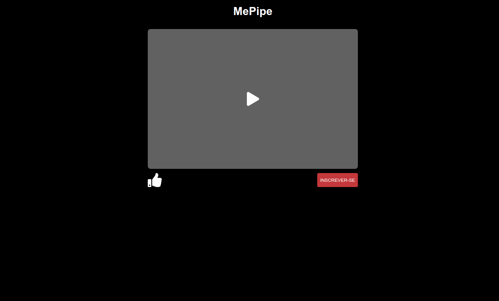

# Boss: MePipe

## Boss description (Descrição do chefão)

### Specifications (Especificações)
  * Difficulty (Dificuldade): Nível Spider Queen
  * Roadmap (Trilha): Frameworks Front-end
  * Topics covered (Assuntos abordados): 
    * Hooks
    * Estado
    * Destructuring
    * useState
    * onClick

### Report (Relato)

O youtube sofreu um <a href="https://pt.wikipedia.org/wiki/Ataque_de_negação_de_serviço">ataque DDoS</a> e nossa equipe não conseguiu estudar.

Sua missão é criar um substituto do youtube, começando com um protótipo.

[Versão interativa](https://gje4o.csb.app)

## Tips (Dicas)
[Guia de estilos com cores, fontes e etc](./design/style-guide.md)

  

    Secrets (Segredos) (não veja antes de quebrar a cabeça um pouco)
  

  <ul>
    <li>Você pode importar arquivos SVG como componentes no React para facilitar a passagem de props </li>
    <li>Dentro de JSX apenas podemos usar <a href="https://developer.mozilla.org/en-US/docs/Web/JavaScript/Guide/Expressions_and_operators#expressions">expressões</a></li>
    <li>Uma tática para usar funções que precisam de parâmetro dentro de props onClick é usar arrow functions para chamar as funções passando os parâmetros. Dessa maneira a função não é executada no início da renderização</li>
    <li>Você pode usar um estado para controlar quais classes um componente possui, afim de deixar dinâmico seu estilo de maneira mais simples</li>
    <li><a href="https://codesandbox.io/s/boss-me-pipe-gje4o">Link da resolução</a></li>  
  </ul>

